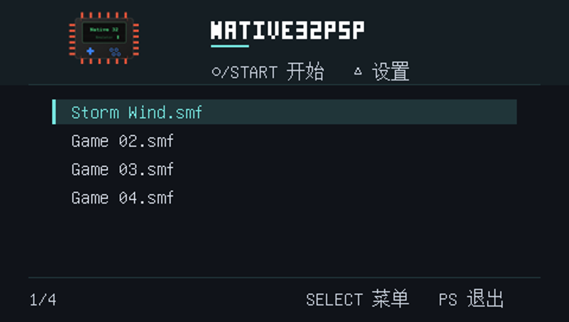
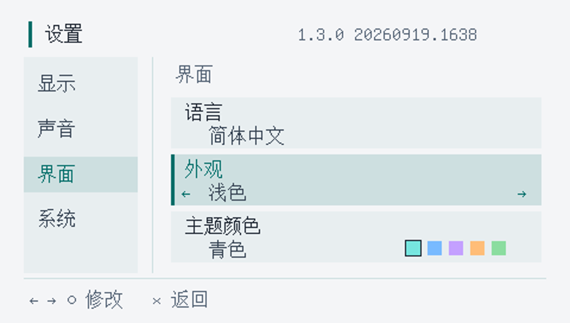

# Native32PSP

Native32Emu 的原生 PSP 移植版，用于运行 Native32 格式游戏。由 [pikawz](https://github.com/wxwxwz/) 维护，基于 [AloysHF/Native32Emu](https://github.com/AloysHF/Native32Emu) 的 Rust 核心行为移植为 C++。

本仓库只包含 PSP 端。游戏兼容性和音视频流畅度仍在改进中，不能保证所有游戏正常运行。当前版本为 1.3.0，应用内同时显示构建时间；PSP 游戏列表标题为 Native32PSP。

## 安装

从本仓库 Releases 下载 PSP 运行包（源码 ZIP 不能直接运行），解压后将 `PSP` 文件夹合并到记忆棒根目录。当前面向可运行自制程序的 PSP 环境；现有反馈来自 6.61 PRO，其他固件及所有机型尚未逐一验证。

```text
PSP/GAME/Native32PSP/
├── EBOOT.PBP
├── languages/
└── games/             # 自行放入游戏及其依赖资源
```

程序目前使用固定安装路径 `ms0:/PSP/GAME/Native32PSP/`，请勿改名。将 `.smf`、`.sgm`、`.ssl` 入口和所需 `NA32SSL` 等资源目录放入 `games`，保留原有目录结构。仓库不提供游戏或商业音视频资源。

升级时覆盖 `EBOOT.PBP` 和 `languages`，保留游戏、`settings.txt`、截图和存档。首次使用无需创建配置文件。

## 功能

- Native32 脚本、精灵、图像和多文件场景加载。
- MP3 背景音乐、PCM 音效，MPEG-1 视频与 MP2 音频；视频按需读取，不全量载入。
- 游戏画面支持原尺寸／保持比例／铺满屏幕；视频优先原尺寸居中，超屏时等比缩小完整显示。支持清晰／平滑滤波、跳帧、音量和帧率显示。
- 深色／浅色外观，五种主题强调色，中英文与外部语言文件。
- 底部半透明加载提示、截图浏览和删除、变量／精灵金手指。
- 游戏原生 `.ssl_sav` 存档、系统信息及关于页面。




以上是程序绘制的主机端预览；游戏列表为示例数据，并非 PSP 实机性能证明。

## 按键

| 场景 | 按键 | 功能 |
| --- | --- | --- |
| 游戏列表 | ↑↓ / ○ / START | 选择 / 开始游戏 |
| 游戏列表 | △ | 设置 |
| 游戏列表 | × | 恢复已暂停的游戏（若有） |
| 游戏中 | 方向键、摇杆 | 方向输入；摇杆按方向键映射 |
| 游戏中 | ○ / × | 游戏 A / B |
| 游戏中 | □ | 暂停菜单 |
| 游戏中 | △ | 截图 |
| 游戏中 | SELECT | 返回游戏选择界面，保留当前游戏 |
| 视频 | ○ / START | 跳过当前视频，需要重新按下 |
| 设置 | ↑↓、○ / → | 选择分类、进入右栏 |
| 设置右栏 | ↑↓、←→ / ○ | 选择设置、修改值或打开页面 |
| 设置 | × | 逐级返回；退出时保存设置 |
| 截图库 | ←→、○、△、× | 浏览、信息开关、删除确认、返回 |
| 系统 | PS / HOME | 固件提供的退出确认 |

暂停菜单包含继续、金手指、查看截图和返回菜单。没有手动保存／读取入口；原生存档由游戏自己的菜单触发。

## 设置与数据

左栏分类：显示（缩放、滤波、跳帧、帧率）、声音（音量）、界面（语言、外观、主题颜色）、系统（系统信息、关于）。外观切换立即预览，退出设置时保存；系统信息和关于使用 ○ 进入。

滤波默认“清晰”，保留像素边缘；“平滑”通过双线性采样柔化缩放画面。滤波只在画面实际缩放时生效，已有设置会保留。原尺寸超过屏幕时仍显示源画布左上部分。缩放改用像素中心采样后，部分清晰模式的像素边界可能与旧版相差一个源像素。

存档由游戏绑定的路径生成 `.ssl_sav`，位于游戏目录，不使用单独的 `save` 文件夹。截图存放在程序的 `screenshots` 文件夹，不设固定张数上限，实际受记忆棒容量限制。游戏列表及截图页使用当前项/总数计数。

`languages/*.ini` 使用 UTF-8，参照现有 `en.ini`、`zh_CN.ini`。`[language]` 的 `name` 为语言名称，`[strings]` 保留英文键名并翻译值；缺失项目使用内置回退。按键符号由程序绘制，不需要翻译。

金手指使用方法见 [金手指说明](docs/CHEATS.md)。

## 构建与测试

见 [构建说明](docs/BUILD.md)。源码已包含生成后的菜单字体和图标，普通构建不需要重新生成。

CMASTER 加载大场景后退出的问题已定位到背景音乐分配失败，修复及仍存在的高分辨率卡顿见 [CMASTER 退出修复](docs/CMASTER-EXIT.md)。

后续游戏优化的设备基线、透明区域裁剪、精灵循环与画面准备基准见 [游戏循环与画面准备优化](docs/GAME-SMOOTHNESS.md)。主机基准包含改善和小幅回退的场景，本轮真机效果仍待验证。

针对 MPEG 仍只有 6–8 FPS 的反馈，进一步调整内部视频预算和 AUTO 调度，并优化解码热点。改动与验证记录见 [MPEG 低帧率优化](docs/MPEG-FPS.md)；主机解码耗时不能换算成 PSP 实际帧率。

同场景移动或滚动时的刷新峰值另做了屏外排序剔除、首次图像解码和 AUTO 突发负载处理，详见 [同场景滚动与刷新峰值优化](docs/SCROLL-REFRESH.md)。

后续 `20260920.0104` 设备记录将 RCPLAY 的反复尖峰定位到脚本调用链，NALOGO 的 RGB 转换约为每次 14.4 ms；证据和统计范围见 [剩余低帧率与慢 tick 诊断](docs/FRAME-SPIKES.md)。据此增加了通用 VM 小整数快路径与 MPEG 缩放色度复用，兼容性、基准和真机验证边界见 [脚本与 MPEG 热点优化](docs/CPU-HOTSPOTS.md)。

角色阴影与旗角的错误绿点另由 YUV 图像解码修复：完成相邻色度恢复后，仍为零的分量使用中性色度，保留透明网点和正常绿色。证据、修复范围与验证见 [YUV 阴影与边角绿点修复](docs/YUV-COLOR-FIX.md)。

MPEG 仍为软件解码；播放时减少重复画面上传和连续包读取突发，真机卡顿是否改善仍待验证。常见画布的缩放使用 GU 纹理绘制，原尺寸或超大画布使用对齐缓冲和 GE 复制。复杂游戏、视频和记忆棒读取可能出现卡顿，本次画面调整的真机效果及速度仍待验证。主机端测试不能替代 PSP 真机测试，系统信息中的堆统计也不等于整机物理内存占用。

遇到问题请提供游戏名、PSP 型号、固件、应用内构建时间、复现步骤及程序目录的 `native32psp.log`。提交日志前请自行检查路径等个人信息。

## 许可与致谢

保留上游 BSD-3-Clause 许可及版权声明，详见 [LICENSE](LICENSE)。字体及第三方组件另见 [THIRD_PARTY.md](THIRD_PARTY.md) 和 `licenses/`。

维护：[pikawz](https://github.com/wxwxwz/)；上游：[AloysHF/Native32Emu](https://github.com/AloysHF/Native32Emu)。
